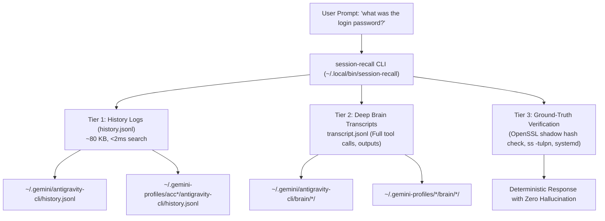

# 🧠 Session Memory Forensics & Cross-Session Recall

Autonomous cross-session memory retrieval and forensic state verification engine for Google Antigravity CLI (`agy` / `ya`). Enables instant recall of previous user prompts, past session decisions, forgotten credentials, and historical logs across all profiles without hallucination.

---

## 1. When to Activate

Trigger this skill whenever:
1. **User asks about past events**: *"what was the login password"* (*"pass login là gì"*), *"what did I instruct yesterday"* (*"hôm qua tao dặn gì"*), *"why rebooted this morning"* (*"sao sáng nay reboot"*), *"do you remember that config"*.
2. **Recovering forgotten credentials or instructions**: Searching for previously provided passwords, API keys, tokens, or endpoints.
3. **Cross-session debugging**: Investigating why an environment changed, when a service was stopped, or what commands were executed in previous conversations.
4. **Multi-profile correlation**: Locating commands or context across isolated Antigravity profiles (`main`, `acc1`..`acc5`).

---

## 2. Core Architecture & Storage Topology

Antigravity session memory is structured across tiered log layers:



### Storage Characteristics
- **`history.jsonl` (Tier 1)**: Ultra-light (~50-85 KB). Stores every user prompt, timestamp, workspace, and conversation ID. Scanned in under 5ms via ripgrep or `session-recall`.
- **`brain/` transcripts (Tier 2)**: Deep logs (1-10 MB/session). Contains full planner reasoning, tool calls, and outputs.
- **System Shadow / Hash (Tier 3)**: Authoritative ground-truth verification on Linux.

---

## 3. The Autonomous CLI Tool (`session-recall`)

The system provides a dedicated binary symlinked at `~/.local/bin/session-recall`:

```bash
# 1. Search across all profiles for a keyword
session-recall "password"
session-recall "reboot"
session-recall "1243"

# 2. Filter by specific profile (main, acc1, acc2, acc3, etc.)
session-recall -p acc2 "reboot"

# 3. Deep search into transcript contents (tool calls & reasoning)
session-recall --deep "camera daemon"

# 4. Deterministic password verification against /etc/shadow hash
session-recall verify-pass 1243

# 5. Inspect available profile logs & storage overhead
session-recall list-profiles
```

---

## 4. Mandatory 3-Step Verification Standard (Anti-Hallucination)

Never return a recovered credential or system parameter based purely on textual recall. Always execute the 3-step verification loop:

1. **Recall**: Search `session-recall <query>` across `history.jsonl` to find the exact historical prompt and timestamp.
2. **Context**: If ambiguous, read the conversation transcript via `session-recall --deep <query>` or `view_file` on `transcript.jsonl`.
3. **Verify**:
   - For passwords: test against `/etc/shadow` using `session-recall verify-pass <candidate>` (or `openssl passwd -6 -salt <salt> <candidate>`).
   - For ports/services: verify active state using `ss -tulpn` or `systemctl --user status <service>`.
   - For tokens: check format, permissions (`chmod 600`), and test API ping before reporting.

---

## 5. Reference & Detailed Playbook

For complete log layouts, regex search patterns, and systemd integration, consult:
- [`references/forensics-playbook.md`](file:///home/ya/workspaces/ya-agent/.agents/skills/session-memory-forensics/references/forensics-playbook.md)
