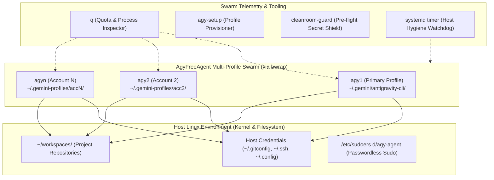
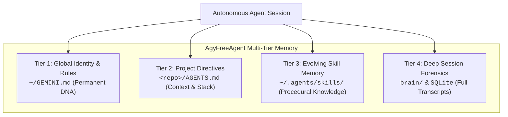
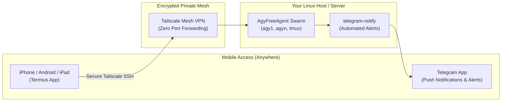

# AgyFreeAgent

<p align="center">
  <strong>No API keys. No credit cards. Just your Google accounts.</strong><br>
  An autonomous, self-healing AI engineering agent with full control over your Linux machine.
</p>

<p align="center">
  <a href="#features">Features</a> •
  <a href="#architecture">Architecture</a> •
  <a href="#60-second-quickstart">Quickstart</a> •
  <a href="#commands">Commands</a> •
  <a href="#security--auth-storage">Security</a> •
  <a href="#comparison">Comparison</a>
</p>

---

## ⚡ The Problem: The High Cost of Autonomous Agents

Most modern autonomous coding agents force developers into painful trade-offs:
1. **The Credit Card Trap**: Burning through hundreds of dollars in OpenAI/Anthropic API bills when an agent gets stuck in a loop.
2. **The Paywalled Subscriptions**: Expensive commercial platforms (OpenAI Codex Pro/Enterprise, hosted sandboxes) that lock your code in remote containers.
3. **The Quota Wall**: Single-session CLI tools that hit rate limits after an hour of heavy coding, bringing work to a halt.

Yet almost every developer already possesses **2 to 5 standard Google accounts**.

**AgyFreeAgent** bridges this gap. Built on top of **Google Antigravity CLI (`agy`)**, it provisions an isolated, multi-profile swarm powered by Linux user-space filesystem namespaces (**Bubblewrap `bwrap`**). You get a persistent, full-control AI engineer running directly on your Linux host—with **zero API keys and zero monthly subscriptions**.

---

## 🚀 Key Features

* **🆓 Zero API Keys Needed**: Authenticates natively via standard Google accounts. No credit cards, no pay-per-token metering.
* **⚡ Multi-Profile Swarm (`agy1` .. `agy<N>`)**: Run multiple accounts in parallel across terminal tabs without credential collisions or quota interference.
* **📊 One-Key Quota Dashboard (`q`)**: Type `q` to instantly inspect live quota status, active process PIDs, CPU%, and memory usage across all profiles.
* **🛡️ Full Machine Control (`sudo all`)**: Includes passwordless sudo automation so the agent can install packages (`apt`, `dnf`), restart systemd daemons, and manage Docker containers without hanging on password prompts.
* **📂 Canonical Workspace Standard (`~/workspaces`)**: Safe, structured workspace routing automatically trusted in agent permissions.
* **⏰ Autonomous Scheduling (Cron & Systemd)**: Run automated background reviews, overnight issue triaging, and CI verification while you sleep.
* **🔒 Isolated Auth Storage**: Google session tokens are compartmentalized per profile inside `~/.gemini-profiles/acc<N>/` via `bwrap`, while host tools (`git`, `ssh`, `docker`) remain natively accessible.
* **📱 Ubiquitous Remote Access**: Command your agent anywhere via **Tailscale Mesh VPN** and **Termius** on mobile, with async alerts delivered straight to **Telegram**.
* **🛡️ Clean-Room Pre-Flight Shield**: Built-in `cleanroom-guard` verifies that no private keys, passwords, or credentials can ever be committed to Git.

---

## 🏛️ Architecture



### Why Bubblewrap (`bwrap`)?
Changing `$HOME` breaks developer dotfiles: Git loses `.gitconfig`, SSH loses keys, Docker loses credentials.
Instead, AgyFreeAgent leaves host `$HOME` completely untouched, mounting only `~/.gemini/antigravity-cli` inside a private namespace for each account. Your dev environment remains 100% intact.

---

## ⏱️ 60-Second Quickstart

### 1. Clone the repository
```bash
git clone https://github.com/HoangYell/agy-free-agent.git
cd agy-free-agent
```

### 2. Run the installer
```bash
./scripts/install.sh
```
The installer will:
* Verify or install `bubblewrap` (`bwrap`).
* Symlink `agy-setup`, `q`, and `cleanroom-guard` into `~/.local/bin/`.
* Initialize `agy1` (Primary Profile).
* Create the canonical workspace folder `~/workspaces`.
* Install the clean-room pre-commit hook.

### 3. (Recommended) Enable Passwordless Sudo for Full Autonomy
Allow your agent to install packages and manage services without hanging on password prompts:
```bash
./scripts/setup-sudo.sh
```

### 4. Provision Additional Google Accounts
To add Account 2, Account 3, etc.:
```bash
agy-setup 2
agy-setup 3
```
Each command generates an isolated launcher (`agy2`, `agy3`) and pre-configures unrestricted permissions.

---

## ⌨️ Commands Cheat Sheet

| Command | Description |
| :--- | :--- |
| **`agy`** or **`agy1`** | Launch the primary Google account agent session. |
| **`agy2`**, **`agy3`**, **`agy<N>`** | Launch an isolated session for Google Account `<N>`. |
| **`agy-setup <N>`** | Provision and configure a new isolated profile for account `<N>`. |
| **`q`** | Check live quota status, OAuth session validity, and running PIDs across all accounts. |
| **`agy-clean-logs`** | Prune stale session logs (>7 days) and vacuum journalctl storage. |
| **`telegram-notify`** | Dispatch real-time task alerts or status updates to Telegram. |
| **`cleanroom-guard`** | Audit staged git files for potential secret, token, or private key leaks. |

---

## 🧠 Memory Architecture: The Multi-Tier Brain

Unlike stateless chat wrappers that wake up with amnesia every morning, or tools that compress your memory into tiny 2,000-character text snippets, **AgyFreeAgent** employs a **4-tier persistent memory hierarchy**:



1. **Tier 1: Global Identity & Core Guidelines (`~/GEMINI.md`)**:
   * Injected into every session across all profiles.
   * Encodes your persona, preferred coding standards, engineering principles, and forbidden patterns. Never compressed or lost.
2. **Tier 2: Project-Scoped Directives (`AGENTS.md` / `GEMINI.md`)**:
   * Placed in the root of any repository under `~/workspaces/<project>/`.
   * Tells the agent the exact architecture, database schemas, test commands, and styling conventions for that specific codebase.
3. **Tier 3: Evolving Procedural Skill Memory (`~/.agents/skills/`)**:
   * When the agent resolves a complex multi-step challenge (e.g. configuring a new build pipeline, Dockerizing a complex stack), it codifies the verified recipe into a skill.
   * Written in standardized Technical English with executable scripts and templates. Shared automatically across all profiles (`agy1`..`agyn`).
4. **Tier 4: Deep Session Forensics & Transcripts (`brain/`)**:
   * Every command executed, reasoning chain, and tool step is recorded in compact `transcript.jsonl` files and indexed in SQLite (`conversation_summaries.db`).
   * The agent can query past sessions to retrieve previous design decisions, historical outputs, and debugging trajectories.

---

## 🪵 Log Management & Host Hygiene

Running an autonomous agent 24/7 generates command outputs, background task logs, and browser caches. AgyFreeAgent organizes and manages logs cleanly:

### Log Layout
* **Session Runtime Logs**: `~/.gemini-profiles/acc<N>/antigravity-cli/log/*.log` (debug logs and OAuth events).
* **Background Task Logs**: `<brain>/<conv-id>/.system_generated/tasks/task-*.log` (stdout/stderr of asynchronous terminal tasks).
* **Scheduled Ops Logs**: `~/.ops/logs/` (cronjob and timer execution output).

### Automated Log Pruning (`agy-clean-logs`)
To prevent logs and caches from bloating your disk, run:
```bash
agy-clean-logs
```
* Prunes session logs older than 7 days (customizable via `RETENTION_DAYS=14 agy-clean-logs`).
* Vacuums Linux `journalctl` user logs to under 200MB.
* Flushes dead Chromium renderers and temporary build artifacts from `/tmp`.

### Automated Daily Maintenance (Systemd)
Enable the automated daily cleanup timer (runs every night at 03:00):
```bash
mkdir -p ~/.config/systemd/user/
cp templates/systemd/agy-cleanup.* ~/.config/systemd/user/
systemctl --user daemon-reload
systemctl --user enable --now agy-cleanup.timer
```

---

## 🔒 Security & Auth Storage

* **Token Isolation**: Google OAuth tokens are stored in `~/.gemini/antigravity-cli/` (acc1) and `~/.gemini-profiles/acc<N>/antigravity-cli/` (acc<N>). Accounts can never access or overwrite each other's tokens.
* **Preserved Host Identity**: Commits made by any profile will still use your personal `git config user.name` and sign with your host SSH/GPG keys.
* **Pre-Flight Defense**: `cleanroom-guard` executes automatically before every `git commit` to block credential leaks.

---

## ⏰ Autonomous Scheduling (Cron & Systemd)

Want your agent to perform routine maintenance, triage issues, or run automated reviews while you're offline?

### Example Cronjob (`crontab -e`)
```bash
# Every morning at 08:00, run agy1 to review pending PRs in workspaces
0 8 * * 1-5 ~/.local/bin/agy1 --prompt "Check all repositories in ~/workspaces, list pending PRs, and summarize today's tasks" >> ~/.ops/logs/briefing.log 2>&1
```

### Systemd User Timer
Ready-to-use systemd service and timer templates are located in `templates/systemd/`:
```bash
mkdir -p ~/.config/systemd/user/
cp templates/systemd/agy-watchdog.* ~/.config/systemd/user/
systemctl --user daemon-reload
systemctl --user enable --now agy-watchdog.timer
```

---

## 📱 Ubiquitous Access: Tailscale, Termius & Telegram

Turn your Linux machine into an autonomous engineering station you can command from anywhere in the world—from an iPad at a coffee shop or an iPhone on the subway.



### 1. Tailscale: Zero-Port-Forwarding Private Mesh
Never expose your server's SSH ports to the public internet. Tailscale creates an encrypted peer-to-peer WireGuard mesh across your personal devices:
```bash
curl -fsSL https://tailscale.com/install.sh | sh
sudo tailscale up --ssh
```
Your machine is now securely accessible from your phone, laptop, or tablet via its private Tailscale IP or MagicDNS hostname (e.g. `ssh user@my-server`).

### 2. Termius: The Pocket AI Engineer (iOS / Android)
**Termius** is the gold-standard mobile terminal client for developers on the go:
* **One-Tap Snippets**: Save shortcuts for `q` (check quota status), `agy1`, and `tmux attach -t agy`.
* **Persistent Sessions**: Run your agent inside `tmux` or `screen`. Close your phone, put it in your pocket, and your agent continues autonomous task execution uninterrupted.
* **On-the-Go Swarm Monitoring**: Check model quotas across all profiles or trigger a background build in seconds from anywhere.

### 3. Telegram: Real-Time Alerts & Task Notifications
Receive instant push notifications when long-running agent tasks complete, builds finish, or errors occur:
1. Create a bot with [@BotFather](https://t.me/BotFather) and get your chat ID via [@userinfobot](https://t.me/userinfobot).
2. Set your environment variables (in `~/.bashrc` or your `.env` file):
   ```bash
   export TELEGRAM_BOT_TOKEN="your_bot_token_here"
   export TELEGRAM_CHAT_ID="your_chat_id_here"
   ```
3. Dispatch alerts directly from agent tasks or bash commands:
   ```bash
   telegram-notify "🚀 Deploy Complete: Production build verified and healthy!"
   ```
4. Integrate with morning cronjobs:
   ```bash
   0 8 * * 1-5 ~/.local/bin/agy1 --prompt "Triage repo issues" | telegram-notify
   ```

---

## 📊 Comparison Matrix

| Feature | AgyFreeAgent | Claude Code | OpenAI Codex | OpenClaw | Hermes Agent |
| :--- | :---: | :---: | :---: | :---: | :---: |
| **API Keys Required** | **Zero (0)** | Anthropic API | OpenAI API | BYO API Keys | BYO API Keys |
| **Cost** | **$0 / Free** | Pay per token | Subscription / API | API Consumption | API Consumption |
| **Execution Host** | **Local Linux / Host** | Local CLI | Remote / Local CLI | Self-Hosted / Docker | Local TUI / Modal |
| **Multi-Account Swarm** | **Native (`bwrap`)** | No | No | Manual env swap | No |
| **Persistent Memory** | **4-Tier (Global+Repo+Skills+SQLite)** | `CLAUDE.md` (flat) | Session Memory | `SOUL.md` + flat | 3 files (~2.2k chars) |
| **System Admin (`sudo`)** | **Full (`sudo all`)** | Interactive prompts | Sandboxed | Partial / Container | Terminal restricted |
| **Quota Telemetry** | **One-key (`q`)** | CLI statusline | Web portal | Basic CLI | None |
| **Background Daemons** | **Systemd & Cron** | Interactive CLI | Webhooks | Docker Daemon | Gateway / Cron |
| **Remote Ops (Mobile)** | **Tailscale + Termius + TG** | SSH only | Cloud web only | Self-hosted Web | Telegram Gateway |
| **Real Visual Test** | **Native Chrome CDP** | Headless MCP | Headless Snapshot | No | No |

---

## 🤝 Contributing & Community

Contributions are welcome! Please ensure all code changes adhere to clean-room standards and pass `./bin/cleanroom-guard`.

1. Fork the Project
2. Create your Feature Branch (`git checkout -b feature/AmazingFeature`)
3. Commit your Changes (`git commit -m 'Add AmazingFeature'`)
4. Push to the Branch (`git push origin feature/AmazingFeature`)
5. Open a Pull Request

---

## 📜 License

Distributed under the MIT License. See [LICENSE](LICENSE) for more information.
