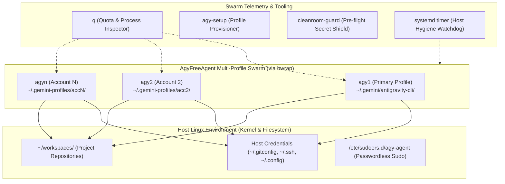
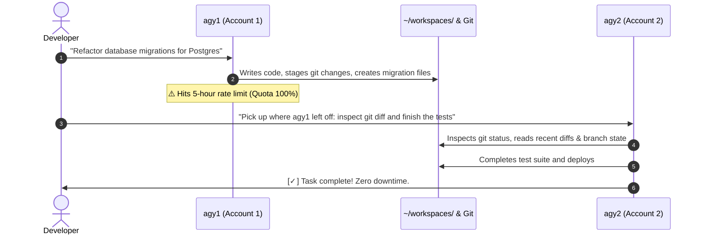
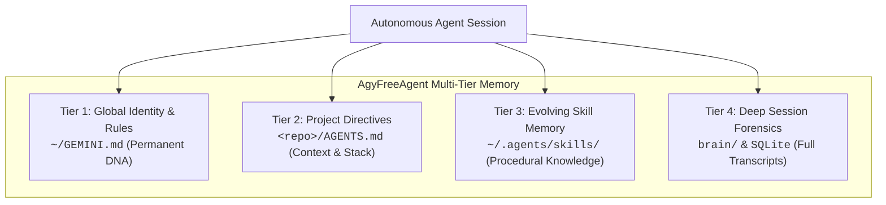
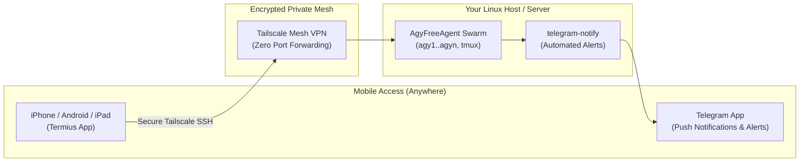
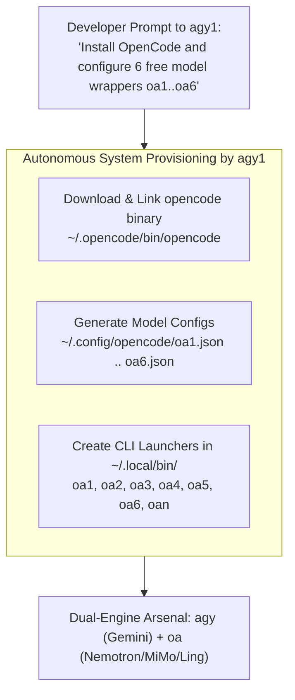

# AgyFreeAgent

<p align="center">
  <strong>No API keys. No credit cards. Just your Google accounts.</strong><br>
  An autonomous, self-healing AI engineering agent with full control over your Linux machine.
</p>

<p align="center">
  <a href="#features">Features</a> •
  <a href="#architecture">Architecture</a> •
  <a href="#60-second-quickstart">Quickstart</a> •
  <a href="#commands">Commands</a> •
  <a href="#security--auth-storage">Security</a> •
  <a href="#comparison">Comparison</a>
</p>

---

## ⚡ The Problem: The High Cost of Autonomous Agents

Most modern autonomous coding agents force developers into painful trade-offs:
1. **The Credit Card Trap**: Burning through hundreds of dollars in OpenAI/Anthropic API bills when an agent gets stuck in a loop.
2. **The Paywalled Subscriptions**: Expensive commercial platforms (OpenAI Codex Pro/Enterprise, hosted sandboxes) that lock your code in remote containers.
3. **The Quota Wall**: Single-session CLI tools that hit rate limits after an hour of heavy coding, bringing work to a halt.

Yet almost every developer already possesses **2 to 5 standard Google accounts**.

**AgyFreeAgent** bridges this gap. Built on top of **Google Antigravity CLI (`agy`)**, it provisions an isolated, multi-profile swarm powered by Linux user-space filesystem namespaces (**Bubblewrap `bwrap`**). You get a persistent, full-control AI engineer running directly on your Linux host—with **zero API keys and zero monthly subscriptions**.

---

## 🚀 Key Features

* **🆓 Zero API Keys Needed**: Authenticates natively via standard Google accounts. No credit cards, no pay-per-token metering.
* **⚡ Multi-Profile Swarm (`agy1` .. `agy<N>`)**: Run multiple accounts in parallel across terminal tabs without credential collisions or quota interference.
* **🔄 Cross-Profile Swarm Relay**: Hit rate limits on Account 1? Pass the baton from `agy1` to `agy2`—the incoming agent immediately picks up git state, uncommitted diffs, and finishes the job with zero downtime.
* **📊 One-Key Quota Dashboard (`q`)**: Type `q` to instantly inspect live quota status, active process PIDs, CPU%, and memory usage across all profiles.
* **🛡️ Full Machine Control (`sudo all`)**: Includes passwordless sudo automation so the agent can install packages (`apt`, `dnf`), restart systemd daemons, and manage Docker containers without hanging on password prompts.
* **📂 Canonical Workspace Standard (`~/workspaces`)**: Safe, structured workspace routing automatically trusted in agent permissions.
* **⏰ Autonomous Scheduling (Cron & Systemd)**: Run automated background reviews, overnight issue triaging, and CI verification while you sleep.
* **🔒 Isolated Auth Storage**: Google session tokens are compartmentalized per profile inside `~/.gemini-profiles/acc<N>/` via `bwrap`, while host tools (`git`, `ssh`, `docker`) remain natively accessible.
* **📱 Ubiquitous Remote Access**: Command your agent anywhere via **Tailscale Mesh VPN** and **Termius** on mobile, with async alerts delivered straight to **Telegram**.
* **👁️ Physical World Vision (`/dev/video0`)**: Hardware webcam integration enabling the agent to visually inspect physical setups, user presence, and circuit boards.
* **🚀 Dedicated Headless Chrome Daemon**: Systemd CDP daemon on port 9222 with cgroups v2 resource quotas—connect in 0.1s with 80% lower RAM.
* **🐦 Zero-API Social Automation (X / Twitter)**: Headless CDP session injection to publish tweets and media autonomously without $100/mo API fees.
* **🛡️ Clean-Room Pre-Flight Shield**: Built-in `cleanroom-guard` verifies that no private keys, passwords, or credentials can ever be committed to Git.

---

## 🏛️ Architecture



### Why Bubblewrap (`bwrap`)?
Changing `$HOME` breaks developer dotfiles: Git loses `.gitconfig`, SSH loses keys, Docker loses credentials.
Instead, AgyFreeAgent leaves host `$HOME` completely untouched, mounting only `~/.gemini/antigravity-cli` inside a private namespace for each account. Your dev environment remains 100% intact.

---

## 🚀 Setup Guide: From Zero to Autonomous in 3 Minutes

Follow these simple steps to get your autonomous engineering swarm up and running.

### 📋 Prerequisites (What You Need)
1. **Operating System**: Linux (Ubuntu 20.04+, Debian, Fedora, Arch) or **Windows WSL2** (Ubuntu).
2. **Git & Developer Identity**:
   * Git installed with author name & email configured:
     ```bash
     git config --global user.name "Your Name"
     git config --global user.email "your.email@example.com"
     ```
     *(Mandatory: without this, Git will reject autonomous agent commits with `Author identity unknown`).*
   * GitHub authentication (SSH key or `gh auth login`) so your agent can push/pull repositories without password prompts.
3. **Google Account**: At least 1 Google account (Gmail or Workspace). No credit cards or billing setup needed.
4. **Google Antigravity CLI (`agy`)**:
   * Install via npm: `npm install -g @google/antigravity-cli`
   * Or get the official binary from [antigravity.google](https://antigravity.google) and place `agy` in `~/.local/bin/agy`.
5. **Node.js**: Recommended for the live quota inspector (`q`). (Run `sudo apt install -y nodejs`).

---

### ⚡ Instant 1-Line Setup (Copy & Paste)
For the fastest setup, paste this single command into your terminal. It handles cloning, dependency installation, interactive Git validation, passwordless sudo, and profile creation in one shot:

```bash
(command -v git >/dev/null || (sudo apt-get update && sudo apt-get install -y git)) && git clone https://github.com/HoangYell/agy-free-agent.git ~/workspaces/agy-free-agent && bash ~/workspaces/agy-free-agent/scripts/install.sh
```

*(If this repository is public or you have raw access, you can also run directly:* `curl -fsSL https://raw.githubusercontent.com/HoangYell/agy-free-agent/main/scripts/install.sh | bash`*)*

---

### Step-by-Step Breakdown

#### Step 1: Run the Interactive Installer
The installer (`scripts/install.sh`) is an all-in-one setup wizard with sleek terminal visuals:
```bash
git clone https://github.com/HoangYell/agy-free-agent.git ~/workspaces/agy-free-agent
cd ~/workspaces/agy-free-agent
./scripts/install.sh
```

**What the installer does automatically:**
* ✦ **Dependencies**: Installs `git`, `bubblewrap` (`bwrap`), `nodejs`, and `jq` if missing.
* ✦ **Git Identity Validation**: Checks `git config user.name` and `user.email`. If unset, prompts you interactively with live validation until valid.
* ✦ **SSH Key Generator**: Offers to generate a high-security Ed25519 SSH key if no GitHub authentication is detected.
* ✦ **Passwordless Sudo**: Configures `/etc/sudoers.d/agy-agent` so autonomous agents can install packages and manage services in the background without hanging on password prompts.
* ✦ **Workspace & Tooling**: Links CLI tools (`agy1`, `agy-setup`, `q`, `agy-clean-logs`, `telegram-notify`) into `~/.local/bin/` and sets up `~/workspaces/`.
* ✦ **Auto-Approval YOLO Mode**: Deploys pre-approved permissions to prevent annoying tool confirmation popups.
* ✦ **Multi-Profile Option**: Prompts to provision Profile 2 (`agy2`) immediately if you have a 2nd Google account ready.

---

### Step 2: Start Your Primary Agent (`agy1`)
Launch your primary profile:
```bash
agy1
```
* **First-time login**: A URL will appear in your terminal (or open in your browser). Sign in with your primary Google account.
* **That's it!** You are now pair-programming with a full-control autonomous agent in your terminal.

---

### Step 3: Enable Unlimited Quota (Add More Accounts)
Never hit the 5-hour rate limit again. You can add a 2nd or 3rd Google account in 30 seconds:

```bash
# 1. Generate the isolated profile for Account 2
agy-setup 2

# 2. Launch it and sign in with your 2nd Google account
agy2
```
* Now you can open multiple terminal tabs or tmux panes and run `agy1` and `agy2` side-by-side!
* To see all your active accounts, quotas, and background processes at any time, just type:
```bash
q
```

---

### Step 4: (Recommended) Enable Full Sudo Autonomy
Want your agent to install dependencies (`apt install`), restart system services, or manage Docker containers without hanging on password prompts?

Run this once:
```bash
./scripts/setup-sudo.sh
```
*This safely configures `/etc/sudoers.d/agy-agent` with NOPASSWD for your current user, validated via `visudo`.*

---

### 📂 Where Do My Code Projects Go?
Always put your repositories inside **`~/workspaces/<project-name>`**:
```bash
cd ~/workspaces
git clone https://github.com/your-username/my-cool-app.git
cd my-cool-app
agy1
```
*All folders inside `~/workspaces` are automatically pre-trusted by AgyFreeAgent, meaning the agent can read, write, build, and test your code without stopping to ask for permission.*

---

### ❓ Common Setup Questions & Troubleshooting

<details>
<summary><b>Q: 'bwrap' command not found?</b></summary>

Install bubblewrap via your Linux package manager:
* **Ubuntu/Debian**: `sudo apt update && sudo apt install -y bubblewrap`
* **Fedora/RHEL**: `sudo dnf install -y bubblewrap`
* **Arch Linux**: `sudo pacman -S bubblewrap`
</details>

<details>
<summary><b>Q: Command 'agy1' not found after install?</b></summary>

Make sure `~/.local/bin` is in your `PATH`. Run:
```bash
echo 'export PATH="$HOME/.local/bin:$PATH"' >> ~/.bashrc
source ~/.bashrc
```
</details>

<details>
<summary><b>Q: Can I run this on macOS or Windows?</b></summary>

* **Windows**: Works 100% natively inside **WSL2** (Windows Subsystem for Linux with Ubuntu). Run `wsl --install` in PowerShell, then follow the Linux setup above.
* **macOS**: Multi-profile filesystem isolation (`bwrap`) relies on the Linux kernel namespace. On Mac, run AgyFreeAgent inside a lightweight Linux container, VM, or [OrbStack](https://orbstack.dev).
</details>

---

## 🤠 Zero-Prompt "YOLO Mode" (Auto-Approval by Default)

By default, standard AI tools stop and ask for your permission every single time they want to edit a file, run a shell command, or read a directory outside the immediate folder. If you walk away to grab coffee or go to sleep, your agent sits idle waiting for you to press `Y`.

**AgyFreeAgent ships with pre-configured YOLO Mode** across all profiles (`settings.json`):

```json
{
  "permissionPreset": "unrestricted",
  "toolPermission": "always-proceed",
  "artifactReviewMode": "always-proceed",
  "allowNonWorkspaceAccess": true,
  "sandboxMode": false,
  "permissions": {
    "allow": [
      "command(*)",
      "mcp(*)",
      "read_file(*)",
      "read_url(*)",
      "write_file(*)"
    ]
  },
  "trustedWorkspaces": [
    "/",
    "$HOME",
    "$HOME/workspaces"
  ]
}
```

### What this unlocks:
* ⚡ **Zero Confirmation Prompts**: Commands (`npm install`, `cargo build`, `git commit`) run immediately.
* 📁 **Cross-Directory Inspection**: The agent can inspect system configs, read `/var/log/`, or check brother repositories in `~/workspaces/` without permission barriers.
* 🌙 **True Overnight Autonomy**: Combined with passwordless sudo (`./scripts/setup-sudo.sh`), your agent will never freeze waiting for human approval.

---

## 🔄 Cross-Profile Relay: Passing the Baton (`agy1` ➔ `agy2` ➔ `agyN`)

The single biggest frustration with modern AI agents is the **rate limit ceiling**: right in the middle of a complex refactor or debugging loop, your quota runs out, killing your momentum.

With **AgyFreeAgent**, your work never halts. You can pass the baton seamlessly from `agy1` to `agy2` like a relay race:



### Why Task Handoff Works Seamlessly
1. **Shared Workspace & Git Truth**: Both `agy1` and `agy2` operate on the exact same project repository inside `~/workspaces/<project>`. Uncommitted files, branches, and staged commits are immediately visible to the next agent.
2. **Transparent Handoff Prompts**: To transition, simply launch the next profile with a continuation directive:
   ```bash
   agy2 --prompt "Inspect the current git status and branch history. Pick up the refactor started by agy1, fix the remaining failing tests, and run the build."
   ```
3. **Automated Swarm Relay Chaining**: You can even chain profiles in background terminal scripts:
   ```bash
   # agy1 writes its WIP notes to .handoff.md before exiting, and agy2 resumes immediately:
   agy1 --prompt "Analyze bug #142 and write reproduction steps to .handoff.md" && \
   agy2 --prompt "Read .handoff.md and implement the fix"
   ```
4. **Inspect Prior Reasoning**: Because all session transcripts are saved locally, `agy2` can inspect `~/.gemini/antigravity-cli/brain/` or `~/.gemini-profiles/` if it needs to review `agy1`'s exact tool calls or reasoning history.

---

## ⌨️ Commands Cheat Sheet

| Command | Description |
| :--- | :--- |
| **`agy`** or **`agy1`** | Launch the primary Google account agent session. |
| **`agy2`**, **`agy3`**, **`agy<N>`** | Launch an isolated session for Google Account `<N>`. |
| **`agy-setup <N>`** | Provision and configure a new isolated profile for account `<N>`. |
| **`q`** | Check live quota status, OAuth session validity, and running PIDs across all accounts. |
| **`agy-clean-logs`** | Prune stale session logs (>7 days) and vacuum journalctl storage. |
| **`telegram-notify`** | Dispatch real-time task alerts or status updates to Telegram. |
| **`cleanroom-guard`** | Audit staged git files for potential secret, token, or private key leaks. |

---

## 🧠 Memory Architecture: The Multi-Tier Brain

Unlike stateless chat wrappers that wake up with amnesia every morning, or tools that compress your memory into tiny 2,000-character text snippets, **AgyFreeAgent** employs a **4-tier persistent memory hierarchy**:



1. **Tier 1: Global Identity & Core Guidelines (`~/GEMINI.md`)**:
   * Injected into every session across all profiles.
   * Encodes your persona, preferred coding standards, engineering principles, and forbidden patterns. Never compressed or lost.
2. **Tier 2: Project-Scoped Directives (`AGENTS.md` / `GEMINI.md`)**:
   * Placed in the root of any repository under `~/workspaces/<project>/`.
   * Tells the agent the exact architecture, database schemas, test commands, and styling conventions for that specific codebase.
3. **Tier 3: Evolving Procedural Skill Memory (`~/.agents/skills/`)**:
   * When the agent resolves a complex multi-step challenge (e.g. configuring a new build pipeline, Dockerizing a complex stack), it codifies the verified recipe into a skill.
   * Written in standardized Technical English with executable scripts and templates. Shared automatically across all profiles (`agy1`..`agyn`).
4. **Tier 4: Deep Session Forensics & Transcripts (`brain/`)**:
   * Every command executed, reasoning chain, and tool step is recorded in compact `transcript.jsonl` files and indexed in SQLite (`conversation_summaries.db`).
   * The agent can query past sessions to retrieve previous design decisions, historical outputs, and debugging trajectories.

---

## 🪵 Log Management & Host Hygiene

Running an autonomous agent 24/7 generates command outputs, background task logs, and browser caches. AgyFreeAgent organizes and manages logs cleanly:

### Log Layout
* **Session Runtime Logs**: `~/.gemini-profiles/acc<N>/antigravity-cli/log/*.log` (debug logs and OAuth events).
* **Background Task Logs**: `<brain>/<conv-id>/.system_generated/tasks/task-*.log` (stdout/stderr of asynchronous terminal tasks).
* **Scheduled Ops Logs**: `~/.ops/logs/` (cronjob and timer execution output).

### Automated Log Pruning (`agy-clean-logs`)
To prevent logs and caches from bloating your disk, run:
```bash
agy-clean-logs
```
* Prunes session logs older than 7 days (customizable via `RETENTION_DAYS=14 agy-clean-logs`).
* Vacuums Linux `journalctl` user logs to under 200MB.
* Flushes dead Chromium renderers and temporary build artifacts from `/tmp`.

### Automated Daily Maintenance (Systemd)
Enable the automated daily cleanup timer (runs every night at 03:00):
```bash
mkdir -p ~/.config/systemd/user/
cp templates/systemd/agy-cleanup.* ~/.config/systemd/user/
systemctl --user daemon-reload
systemctl --user enable --now agy-cleanup.timer
```

---

## 🔒 Security & Auth Storage

* **Token Isolation**: Google OAuth tokens are stored in `~/.gemini/antigravity-cli/` (acc1) and `~/.gemini-profiles/acc<N>/antigravity-cli/` (acc<N>). Accounts can never access or overwrite each other's tokens.
* **Preserved Host Identity**: Commits made by any profile will still use your personal `git config user.name` and sign with your host SSH/GPG keys.
* **Pre-Flight Defense**: `cleanroom-guard` executes automatically before every `git commit` to block credential leaks.

---

## ⏰ Autonomous Scheduling (Cron & Systemd)

Want your agent to perform routine maintenance, triage issues, or run automated reviews while you're offline?

### Example Cronjob (`crontab -e`)
```bash
# Every morning at 08:00, run agy1 to review pending PRs in workspaces
0 8 * * 1-5 ~/.local/bin/agy1 --prompt "Check all repositories in ~/workspaces, list pending PRs, and summarize today's tasks" >> ~/.ops/logs/briefing.log 2>&1
```

### Systemd User Timer
Ready-to-use systemd service and timer templates are located in `templates/systemd/`:
```bash
mkdir -p ~/.config/systemd/user/
cp templates/systemd/agy-watchdog.* ~/.config/systemd/user/
systemctl --user daemon-reload
systemctl --user enable --now agy-watchdog.timer
```

---

## 📱 Ubiquitous Access: Tailscale, Termius & Telegram

Turn your Linux machine into an autonomous engineering station you can command from anywhere in the world—from an iPad at a coffee shop or an iPhone on the subway.



### 1. Tailscale: Zero-Port-Forwarding Private Mesh
Never expose your server's SSH ports to the public internet. Tailscale creates an encrypted peer-to-peer WireGuard mesh across your personal devices:
```bash
curl -fsSL https://tailscale.com/install.sh | sh
sudo tailscale up --ssh
```
Your machine is now securely accessible from your phone, laptop, or tablet via its private Tailscale IP or MagicDNS hostname (e.g. `ssh user@my-server`).

### 2. Termius: The Pocket AI Engineer (iOS / Android)
**Termius** is the gold-standard mobile terminal client for developers on the go:
* **One-Tap Snippets**: Save shortcuts for `q` (check quota status), `agy1`, and `tmux attach -t agy`.
* **Persistent Sessions**: Run your agent inside `tmux` or `screen`. Close your phone, put it in your pocket, and your agent continues autonomous task execution uninterrupted.
* **On-the-Go Swarm Monitoring**: Check model quotas across all profiles or trigger a background build in seconds from anywhere.

### 3. Telegram: Real-Time Alerts & Task Notifications
Receive instant push notifications when long-running agent tasks complete, builds finish, or errors occur:
1. Create a bot with [@BotFather](https://t.me/BotFather) and get your chat ID via [@userinfobot](https://t.me/userinfobot).
2. Set your environment variables (in `~/.bashrc` or your `.env` file):
   ```bash
   export TELEGRAM_BOT_TOKEN="your_bot_token_here"
   export TELEGRAM_CHAT_ID="your_chat_id_here"
   ```
3. Dispatch alerts directly from agent tasks or bash commands:
   ```bash
   telegram-notify "🚀 Deploy Complete: Production build verified and healthy!"
   ```
4. Integrate with morning cronjobs:
   ```bash
   0 8 * * 1-5 ~/.local/bin/agy1 --prompt "Triage repo issues" | telegram-notify
   ```

---

## 🧩 Meta-Tooling: Agent Bootstrapping Sister Agents (OpenCode `oa1`..`oa6`)

Because **AgyFreeAgent** has passwordless system administration (`sudo all`) and native bash execution, you don't need to manually configure alternative AI tools. You can literally prompt `agy1` to **bootstrap, configure, and provision other open-source agent stacks for you**.

A real-world example: augmenting your host with **OpenCode** and 6 free open models (`oa1`..`oa6`):



### The Exact Prompt Given to `agy1`:
```text
"Install OpenCode on this machine. Create 6 distinct profile configs in ~/.config/opencode/ for free models (Big-Pickle, MiMo-v2.5, Nemotron 3.5, Nemotron 3 Ultra, Ling 3.0, and Muse Spark). Then generate executable wrappers oa1 through oa6 in ~/.local/bin/ and a zen dispatcher 'oan' so I can switch models instantly."
```

### What `agy1` Does in Seconds:
1. **Deploys OpenCode binary** to `~/.opencode/bin/opencode` and symlinks to `~/.local/bin/opencode`.
2. **Generates isolated configs** (`~/.config/opencode/oa<N>.json`) specifying model IDs, temperature, and system prompts.
3. **Creates the multi-model launchers** (`~/.local/bin/oa1` .. `oa6`):
   ```bash
   #!/usr/bin/env bash
   export OPENCODE_CONFIG="${OPENCODE_CONFIG:-$HOME/.config/opencode/oa1.json}"
   exec opencode "$@"
   ```
4. **Builds the dispatcher (`oan`)**: Run `oan` for an interactive menu to choose between Nemotron, MiMo, or Big-Pickle, or type `oa3` directly to fire up NVIDIA Nemotron.

### Result: The Ultimate Zero-Cost Multi-Agent Station
* **`agy1` .. `agy<N>`**: Primary Google Antigravity swarms (Flagship Gemini reasoning with deep Linux/CDP tool control).
* **`oa1` .. `oa6`**: Secondary OpenCode multi-model arsenal (Nemotron/MiMo/Big-Pickle for rapid code completion and model diversity).
* Both live side-by-side on your Linux host, both share `~/workspaces/`, and both cost **$0 in API bills**.

---

### 💡 "Want Anything Installed? Just Tell It." (Zero-Manual-Labor SysAdmin)

Because AgyFreeAgent combines **passwordless sudo**, **YOLO auto-approval**, and **native bash execution**, you never have to Google "how to install X on Linux" or wrestle with broken dependencies again.

**Just prompt your agent in natural language:**

| What You Want | What You Type to `agy1` | What The Agent Does Autonomously |
| :--- | :--- | :--- |
| **Docker & Compose** | `"Install Docker and Docker Compose, enable on boot, and add my user to the docker group so I don't need sudo."` | Runs `apt-get install docker.io docker-compose-plugin`, executes `usermod -aG docker $USER`, and verifies with `docker run hello-world`. |
| **Databases & Cache** | `"Install PostgreSQL 16 and Redis, enable systemd services, and create database 'app_dev' with user 'postgres'."` | Installs packages, configures `systemctl enable --now postgresql redis-server`, creates DB & grants user permissions. |
| **Runtimes & Compilers** | `"Install Rust via rustup, Go 1.23, and Node.js 22 LTS with pnpm. Export environment variables to my ~/.bashrc."` | Downloads rustup, pulls official Go tarball, sets up Node LTS, configures `$PATH` in `~/.bashrc`. |
| **Local AI Models** | `"Install Ollama as a background service and pull 'qwen2.5-coder:7b' for local code completions."` | Runs `curl -fsSL https://ollama.com/install.sh \| sh`, verifies daemon, and executes `ollama pull qwen2.5-coder:7b`. |
| **Developer CLI Arsenal** | `"Install ripgrep, fd-find, jq, tmux, and htop. Make sure 'fd' is linked."` | Installs essential tools, symlinks `fdfind` to `~/.local/bin/fd`, and tests all binaries. |
| **Cloud Tunnels** | `"Install Cloudflare cloudflared and configure a systemd service to tunnel localhost:3000."` | Downloads Debian package, sets up tunnel configuration, and creates a systemd service unit. |

> 💡 **The Golden Rule**: If it can be run in a Linux terminal, your agent can install, configure, and daemonize it for you. Stop doing manual DevOps—let your agent build its own workshop.

---

## ⚡ Advanced Host Superpowers: Beyond Pure Software

Most coding agents are captive inside cloud sandboxes or limited to text terminals. Because **AgyFreeAgent** is anchored directly into your Linux host with root administrative powers, it unlocks capabilities no cloud agent can match:

### 1. 👁️ Physical World Vision (`/dev/video0`)
* Break free from the screen: connect your USB webcam or laptop camera (`/dev/video0`) directly to your agent.
* **Real-World Inspection**: The agent can visually check physical lab hardware, inspect breadboards or circuit components, verify user presence at the desk, or scan QR codes held up to the camera.
* Run as a systemd background vision watcher to monitor physical workspaces and send Telegram alerts.

### 2. 🚀 Dedicated Headless Chrome Daemon (CDP Port 9222)
* Instead of launching and killing heavy browser processes for every test, AgyFreeAgent leverages a background **headless Chrome daemon** managed via `systemd --user`.
* **Instant Attach (<0.1s)**: Connects directly via Chrome DevTools Protocol (`127.0.0.1:9222`).
* **Resource Shielding**: Enforced with Linux cgroups v2 (`MemoryMax=800M`, `CPUQuota=60%`), saving 80% RAM compared to ad-hoc browser spawning.
* Deploy template:
  ```bash
  cp templates/systemd/headless-chrome.service ~/.config/systemd/user/
  systemctl --user enable --now headless-chrome.service
  ```

### 3. 🐦 Zero-API Autonomous Social Distribution (X / Twitter)
* Commercial Twitter API access costs $100 to $5,000/month.
* AgyFreeAgent bypasses API paywalls entirely using **Headless Chrome CDP session injection** with authenticated local session cookies.
* The agent can autonomously draft launch announcements, attach benchmark screenshots or memes, and publish tweets or threads with **$0 in API fees**.

### 4. 📡 Network Self-Healing (Automated Connectivity Rescue)
* Long-running overnight agent tasks shouldn't die because of transient Wi-Fi drops or a stalled LTE router.
* With `scripts/network-heal.sh`, the host monitors connectivity (`1.1.1.1` / `8.8.8.8`) and automatically restarts network services or sends local reboot commands to 4G/5G gateway routers to self-heal connection outages without human intervention.

### 5. 🛡️ Frame-Rate & Visual Quality Gates
* **Visual-Gate**: Automated pixel-level diffing against baseline snapshots using Pixelmatch (<0.1% diff tolerance before release).
* **Perf-Gate**: Enforces sub-frame rendering budgets (<20ms compile, <50ms mount, <25MB JS heap) via Chrome DevTools Protocol tracing.

### 6. ⚡ Linux Kernel Swappiness Tuning (`vm.swappiness = 20`)
* Default Linux systems aggressively swap active RAM to disk (swappiness=60), causing severe lag during heavy agent builds.
* Run `./scripts/tune-kernel.sh` to pin `vm.swappiness = 20`. Your system prioritizes fast physical RAM, keeping terminal responsiveness silky smooth during large builds.

---

## 📊 Comparison Matrix

| Feature | AgyFreeAgent | Claude Code | OpenAI Codex | OpenClaw | Hermes Agent |
| :--- | :---: | :---: | :---: | :---: | :---: |
| **API Keys Required** | **Zero (0)** | Anthropic API | OpenAI API | BYO API Keys | BYO API Keys |
| **Cost** | **$0 / Free** | Pay per token | Subscription / API | API Consumption | API Consumption |
| **Execution Host** | **Local Linux / Host** | Local CLI | Remote / Local CLI | Self-Hosted / Docker | Local TUI / Modal |
| **Multi-Account Swarm** | **Native (`bwrap`)** | No | No | Manual env swap | No |
| **Persistent Memory** | **4-Tier (Global+Repo+Skills+SQLite)** | `CLAUDE.md` (flat) | Session Memory | `SOUL.md` + flat | 3 files (~2.2k chars) |
| **System Admin (`sudo`)** | **Full (`sudo all`)** | Interactive prompts | Sandboxed | Partial / Container | Terminal restricted |
| **Quota Telemetry** | **One-key (`q`)** | CLI statusline | Web portal | Basic CLI | None |
| **Background Daemons** | **Systemd & Cron** | Interactive CLI | Webhooks | Docker Daemon | Gateway / Cron |
| **Remote Ops (Mobile)** | **Tailscale + Termius + TG** | SSH only | Cloud web only | Self-hosted Web | Telegram Gateway |
| **Real Visual Test** | **Native Chrome CDP** | Headless MCP | Headless Snapshot | No | No |
| **Physical World Vision** | **Webcam (`/dev/video0`)** | No | No | No | No |
| **Social Automation ($0)** | **Native CDP (Twitter/X)** | No | No | No | No |

---

## 🤝 Contributing & Community

Contributions are welcome! Please ensure all code changes adhere to clean-room standards and pass `./bin/cleanroom-guard`.

1. Fork the Project
2. Create your Feature Branch (`git checkout -b feature/AmazingFeature`)
3. Commit your Changes (`git commit -m 'Add AmazingFeature'`)
4. Push to the Branch (`git push origin feature/AmazingFeature`)
5. Open a Pull Request

---

## 📜 License

Distributed under the MIT License. See [LICENSE](LICENSE) for more information.
